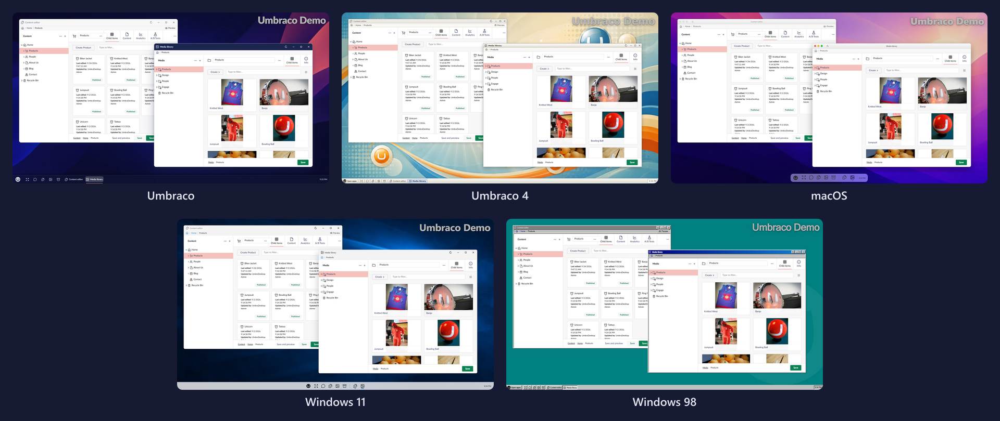
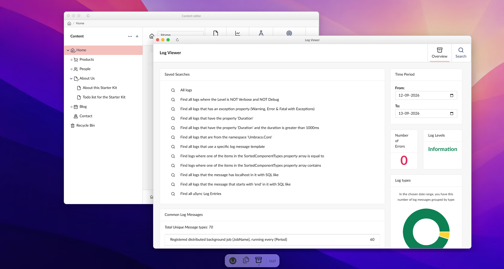
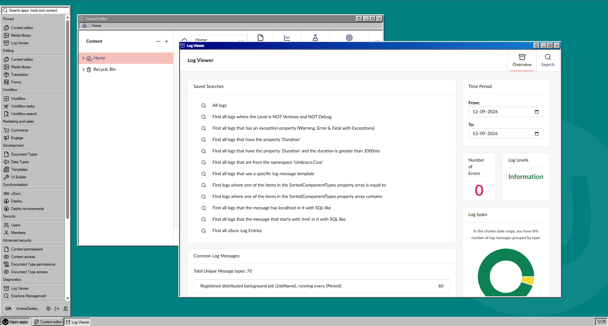
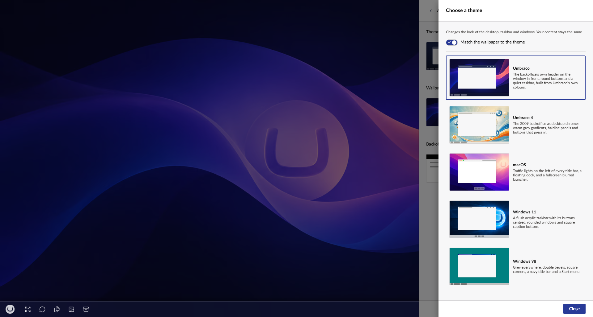

# Themes

A theme restyles the launcher, the taskbar and the window chrome. It never changes the content inside
a window, which stays the backoffice you already know.

## Change the theme

1. Open [Desktop settings](../settings/desktop-settings.md) and select **Appearance**.
2. Select the **Theme** row. It shows the current theme as a miniature of the desktop it paints.
   The **Choose a theme** panel opens, with every theme drawn the same way: the window, the title bar
   buttons where that theme puts them, and the taskbar.
3. Select a theme. It applies straight away, and the panel stays open, so you can go through them
   and watch the desktop change behind it.

The choice is stored on your Umbraco account, so it follows you between machines. Changing the theme
leaves the wallpaper alone, unless [Match the wallpaper to the theme](#match-the-wallpaper-to-the-theme)
is on.

## The five themes

- **Umbraco**. The default, built from Umbraco's own design tokens, so the desktop reads as part of
  the backoffice rather than bolted on.
- **Umbraco 4**. The 2009 backoffice as desktop chrome: warm grey gradients, hairline panels,
  buttons that press in, and the old Sections panel as the launcher, with glossy orbs for pinned
  apps.
- **macOS**. Traffic lights on the left of each title bar, a floating dock, and a full-screen blurred
  launcher.
- **Windows 11**. A flush acrylic taskbar with its buttons centred, rounded windows with square
  caption buttons, and Start as a card floating above the bar.
- **Windows 98**. Grey everywhere, double bevels, square corners, a navy title bar, and the launcher
  as a Start menu.

## Light, dark and high contrast

Themes follow the backoffice's own Light and Dark settings. Under High contrast a theme uses its
darkest colours, while window content switches to Umbraco's real high-contrast styling. Umbraco 4 and
Windows 98 ship a single palette on purpose: their grey is the design rather than a light-mode
choice, so they look the same under all three.

To change between Light, Dark and High contrast, see
[Backoffice theme](backoffice-colours.md).

## Match the wallpaper to the theme

Switching to Windows 98 gives a Windows 98 desktop with an Umbraco wallpaper still behind it. The
chrome changes and the picture behind it does not. **Match the wallpaper to the theme** fixes that:
each theme brings its own background.

| Theme | Wallpaper |
| --- | --- |
| Umbraco | Aurora Flow |
| Umbraco 4 | Retro Swoosh, the v4-era artwork |
| macOS | First Light |
| Windows 11 | Cobalt Beacon |
| Windows 98 | None, because a Windows 98 nobody had personalised showed bare teal and nothing else |

To turn it on, switch on **Match the wallpaper to the theme** above the list in the **Choose a
theme** panel.

It is off to begin with, and turning it on changes nothing on screen. It says what picking a theme
will do from now on, so the wallpaper changes on the next theme selected. What does change
immediately is the previews: each theme's miniature shows its own wallpaper, so you can see where a
click will land.

To apply the current theme's wallpaper without switching theme, select the theme already in use.

Choosing a wallpaper yourself turns the setting off again and keeps the wallpaper you chose, so the
setting never quietly discards a picture you picked.

A theme names one wallpaper, not a light one and a dark one. macOS pairs its own backgrounds that
way, so under Dark the macOS theme gives dark chrome over a bright background. Pick a wallpaper by
hand if that bothers you.

## Build your own

A theme is a folder of CSS and one catalogue entry, with no change to the chrome itself. See
[Theming](../../developer/theming.md) in the developer guide.
