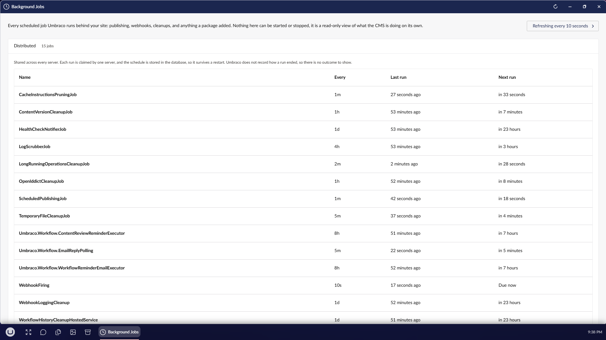

# Background Jobs

Umbraco runs a lot behind a site: scheduled publishing, webhook delivery, log and version cleanups,
plus whatever the installed packages added. It shows none of it. Background Jobs is a read-only view
of all of it, with how often each job runs, when it last ran, how that went and when it is due next.

It installs as an ordinary dashboard in the Settings section, so it is there whether or not the
desktop is used. On the desktop it is an app of its own, in the Diagnostics group.

## Two kinds of job

Jobs come in two kinds, and the screen keeps them apart, because they answer different questions.

- **Distributed** jobs are shared across every server. One server claims each run, and the schedule
  lives in the database, so it survives a restart. Umbraco does not record how a run ended, so there
  is no outcome to show for these.
- **Recurring** jobs are run by each server for itself. Umbraco stores nothing about them, so what
  shows has been observed since this server started, and a job that has not come round yet reads
  **Not since restart** rather than "Never". These do carry an outcome: succeeded, failed, or
  skipped because this server's role was not one the job runs on.

## Times and refreshing

Times are shown relative to now, with the exact moment on hover.

The view refreshes itself. To change how often, pick 1, 5 or 10 seconds from the control at the top
right.

Because the data is a snapshot, a run due within one refresh reads "Due now" rather than counting
past zero: it may already have happened without this copy of the report knowing yet.

Nothing here can be started, paused or cancelled. It is a viewer.
