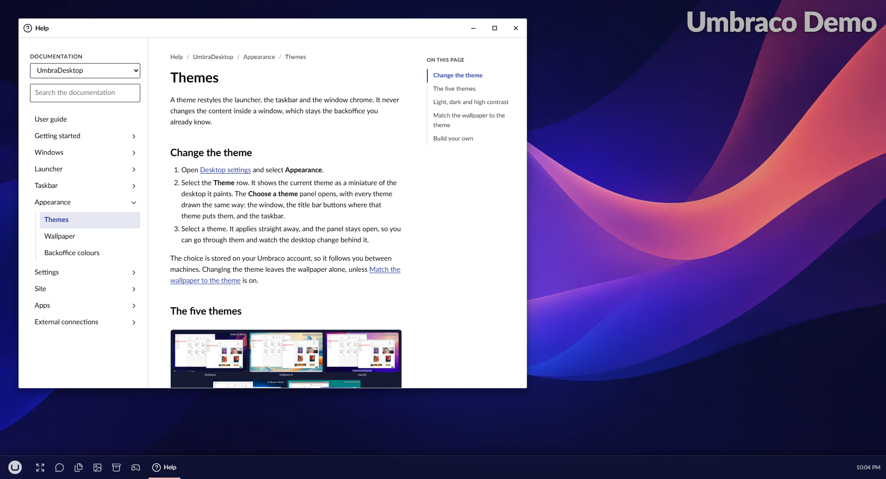

# Help

Help shows the documentation of UmbraDesktop and of every installed add-on that brings its own, for
exactly the version installed. It is read from the site itself, so it works without internet access
and never shows pages for a newer or older version.



## Open Help

To open Help, open the launcher and select **Help** in the System group. Help opens on a card for
the user guide of UmbraDesktop and of every add-on that brings its own. The developer guides, for
building on the desktop, are listed below the cards under **For developers**.

Help can be open in several windows at once, for example to read two pages side by side. Each window
remembers the page it was on, so after a reload it comes back at that page.

## Find a page

- To open a guide, select its card, or its name under **For developers**. To switch to another
  guide from a page, choose it under **Documentation** at the top of the sidebar.
- To read a page, select it in the sidebar. The sidebar shows the guide's top level; selecting a
  category opens its overview and shows its pages, and the arrow beside a category shows or hides
  them without leaving the page.
- To go back up, select a step in the breadcrumb above the page. **Help** goes back to the cards.
- To jump to a section, select it under **On this page**, to the right of the page. The section being
  read is marked there as the page scrolls.
- To search, type in the search box. It searches the titles, headings and text of the guide being
  read, and each result opens the page at the section it was found in.

Links between pages open in the same window. A link to another installed package's documentation
opens that package's page. Links to anything else open in a new browser tab.

In a narrower window **On this page** is left out, and in a narrow one, such as one snapped to half of
a small screen, the sidebar is hidden behind a **Contents** button.

## Link to a page

A link to a Help page works from anywhere, such as an email, a chat message or a bookmark:

```
/umbraco/section/umbradesktop?help=umbradesktop/overwrite-protection
```

The part after `help=` names the package, the page and, optionally, a heading:
`umbradesktop/live-preview/headless-sites`. The desktop opens, then opens Help at that page. If a
Help window already shows that page, it comes to the front instead of a second one opening.

When the page is not in the installed version, which can happen with a link written for a newer
version, Help opens the package's front page and says so. When the package is not installed at all,
Help opens on its cards and says that.

## For package authors

An add-on can bring its own documentation to Help. See
[Help for your add-on](../../developer/add-on-help.md) in the developer guide.
