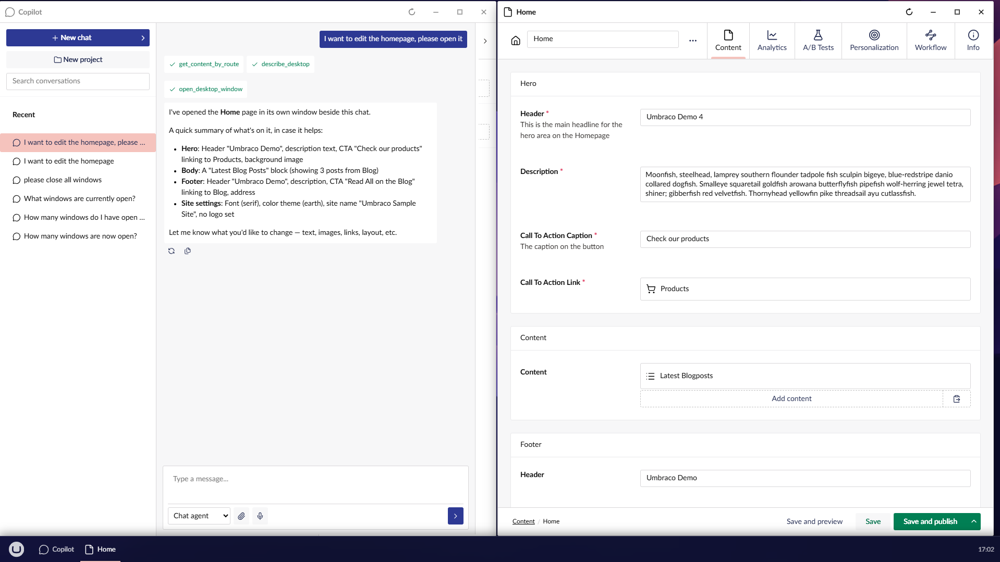

# Umbraco AI

With Umbraco AI installed, the desktop gives its agent two things the plain backoffice cannot: a chat
that stays beside the pages it is about, and a desk the agent can act on.

Needs **Umbraco AI 17.4 or later**. Without the package, on an older version, or for a user without
permission to the Copilot Workspace section, none of this appears: no launcher tile, no tools, and
nothing added to the chat. UmbraDesktop does not depend on Umbraco AI and never requires it.

## The chat in a window

The **Copilot Workspace** opens as an ordinary app, from the launcher's AI group or from the
[AI chat button](../taskbar/using-the-taskbar.md#the-fixed-row) on the taskbar. It is Umbraco's own
chat, with its conversation list, its projects and its attachments, in a window, so the chat sits
beside the pages it is about instead of replacing them.

It opens in one window rather than several. Conversations are switched in the workspace's own
sidebar, and switching stops whatever the agent was doing, as Umbraco's own section does too.

## Answers open as windows

Ask where something is, and the agent can put it on the desk in its own window, without leaving the
conversation. In a single-page backoffice, following a link is a navigation and the chat resets; on
the desktop both survive.

If the item is already open, that window comes to the front instead of a second one opening on the
same document, unless another one is asked for on purpose. The agent opens the desktop's own apps
too, so "open the log viewer" works as well as "open the pricing page".

## It can tidy up

"Close everything" does what it says, with two exceptions: a window holding unsaved changes is left
open and named back to you, and the chat's own window stays. So the agent cannot lose your work, and
no dialog appears out of nowhere.

## It can read your desk

The agent can ask which windows are open, what each shows, which is in front, and which hold unsaved
changes, so "the page I have open" is a phrase that works. It is also how the agent knows which apps
this desktop can open.

What it reads is a snapshot taken at the moment it asks, not a live feed, so what a conversation says
stays true of when it was said. It reads identity only, never your unsaved edits. Reading a document
is the agent's own job, and it can do that whether or not the document is open.

## Changes made by the agent

From 17.4 the agent writes on the server, so it can change a document you have open in front of you.
[Overwrite protection](../windows/overwrite-protection.md) covers the agent exactly as it covers a
colleague.
