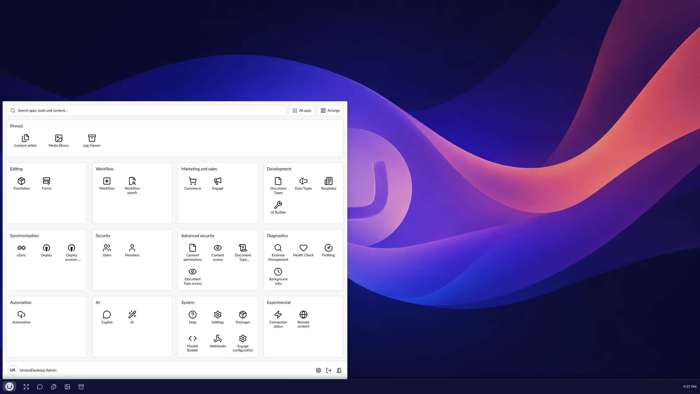

# Using the launcher

The launcher is where apps are opened.

- To open the launcher, select the launcher button on the taskbar.
- To open an app, select its tile. It opens in a window.

## Groups

Apps are grouped by what they do: Editing, Workflow, Marketing and sales, Development,
Synchronisation, Security, Advanced security, Diagnostics, Automation, AI and System. A package can
bring a heading of its own, such as the Entertainment add-on's Games. Empty groups never show.

Any section that no catalogue entry covers still shows up, under **More**, with a generic icon.
Nothing is hidden just because it has not been curated. See
[Commercial packages](../apps/commercial-packages.md) for the packages the desktop knows by name.

## Find an app

- To find an app by name, type in the search box at the top of the launcher.
- To see every app from A to Z, select **All apps**, next to the search box. It has a filter of its
  own and no groups.

## Pinned apps

Pinned apps sit at the top of the launcher, under **Pinned**, instead of in their group. They also
show as icons on the taskbar, beside the launcher button. One pin shows in both places. See
[Using the taskbar](../taskbar/using-the-taskbar.md).

By default the Content editor, the Media library and the Log Viewer are pinned.

To pin an app, drag its tile onto **Pinned**. [Arranging the launcher](arranging-the-launcher.md)
covers the other ways.

Pins are stored on your Umbraco account, so they follow you to any browser you sign in on.

## The footer

- To open Desktop settings, select the cog in the launcher's footer. See
  [Desktop settings](../settings/desktop-settings.md).
- To return to the classic backoffice, select **Exit desktop**. See
  [First steps](../getting-started/first-steps.md#return-to-the-classic-backoffice).

## Closing the launcher

Escape closes the launcher, or steps back to it first from **All apps** or **Arrange**. The launcher
stays open when you switch to another program and back.
