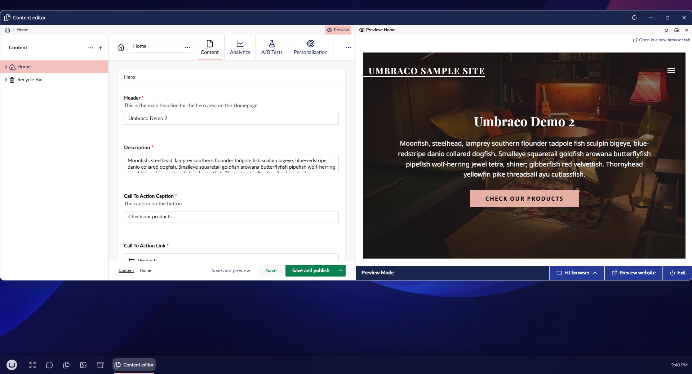

# Live preview

The preview shows a document's page beside its editor, the way **Save and preview** would show it,
without leaving the desktop and without saving.

## Open and close the preview

- To open the preview, select **Preview** at the right of a document window's path. The button
  shows as pressed while the preview is open.
- To close the preview, select **Preview** again, or select close in the preview's header.

## What it shows

The preview shows the last saved version. While the editor holds unsaved changes, a line above the
page says so. Each save or publish reloads the preview, and so does somebody else saving the same
document. Typing does not.

## Docked or in a window

When there is room, the preview opens docked: a pane inside the document window. The window grows to
make room, so the editor keeps its width. On a desktop too narrow for both, the preview opens as a
window of its own instead.

- To resize a docked preview, drag the divider between it and the editor.
- To pop a docked preview out into a window, select pop out in its header, or drag the header a
  little way, the way a browser tab is pulled out.
- To reload the preview, select reload in its header.

As a window of its own, the preview has the usual window controls, and a strip under its title that
names the window it belongs to.

- To dock it again, select **Dock** in that strip, or drag it into the document window and let go on
  one of the zones that appear inside its left and right edges.

On the taskbar, a popped-out preview's button sits in one box with its document's button. Each button
works on its own.

## It belongs to its document

The preview rises, minimises and closes with its document window. It also closes when that window
moves to a different document.

## Device widths and preview options

- To see the page at another width, select **Phone width**, **Tablet width** or **Desktop width**.
  These buttons show for a headless front end. Umbraco's own preview page has a device switcher of
  its own in its footer, so there the desktop's buttons stay out of its way.
- If the site offers more than one way to preview, as extra entries under **Save and preview**, a
  picker chooses between them.
- To see the page full size, or when it cannot be shown inside the desktop, select **Open in a new
  browser tab**. It is always there.

## Headless sites

The preview asks Umbraco for the same URL the **Save and preview** button opens, from the same URL
provider. A headless site that registers its own provider for its front end gets its front end in the
preview, with nothing to configure in the desktop.

The front end has to allow itself to be shown inside the backoffice. The preview is an iframe, so:

- Allow the backoffice's origin in `Content-Security-Policy: frame-ancestors`.
- Do not send `X-Frame-Options: DENY`, or `SAMEORIGIN` when the front end is on a different origin
  from the backoffice.
- If previewing depends on a cookie and the front end is on a different site from the backoffice,
  set that cookie to `SameSite=None; Secure`. A browser does not send `Lax` or `Strict` cookies to a
  frame from another site.

When a front end refuses, the browser shows an empty or error page in the frame, and the desktop
cannot tell that apart from a page that loaded. **Open in a new browser tab** still works.
