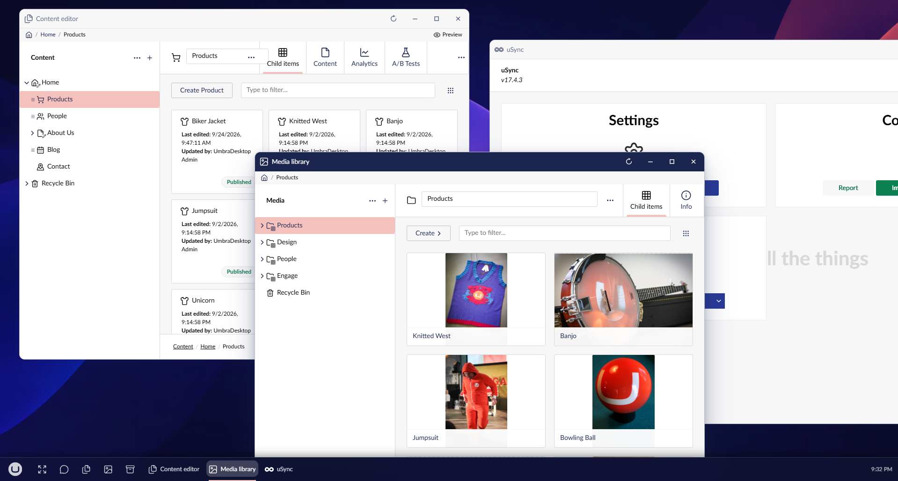

# Working with windows

Every app opens in a window of its own. Each window remembers its own place.

## Move and resize

- To move a window, drag its title bar.
- To resize a window, drag an edge or a corner.
- To maximise a window, double-click its title bar. Double-click it again to restore it.
- To minimise a window, use the minimise button in its title bar, or select its button on the
  [taskbar](../taskbar/using-the-taskbar.md).

A window cannot be made smaller than its minimum size. See [Screen size](../getting-started/screen-size.md)
for why.

To give a window exactly half the desktop, drag it to the left or right edge. See
[Snapping](snapping.md).

## Go back with the path

A window that holds a whole section shows a path under its title bar, such as
Media library / Campaigns / hero.jpg. The plain backoffice climbs back out of a tree through the
section name in its header, and a window has no header, so this is where that goes.

- To go back to any step, select it in the path.
- To return the window to the page it opened at, select the first step.

If the window has unsaved changes, it asks before leaving, the same way closing it does.

A window that shows a document also has a **Preview** button at the right of its path. See
[Live preview](live-preview.md).

## While a window loads

While a window fetches its content, whether it has just opened or just reloaded, it shows the
Umbraco mark with a ring turning around it, the same animation the boot screen uses. It covers the
window until the content is ready, so a half-drawn backoffice never shows.

## Several windows of one app

Some apps, such as the Content editor and the Media library, can be open in more than one window at
once, for example to compare two documents. Others open once, and selecting them again brings their
window to the front.
