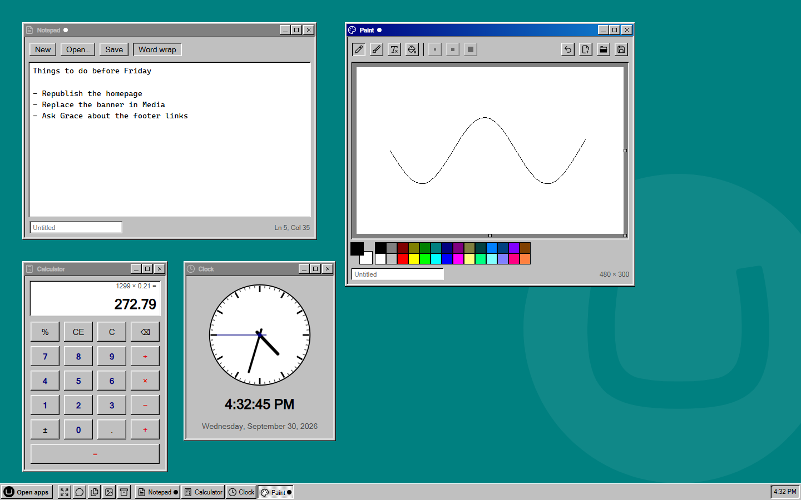

# UmbraDesktop Accessories

The small tools for UmbraDesktop. Notepad, Paint, Sticky Notes, Calculator, Character Map, Clock, Disk Cleanup and System Information, the ones Windows kept under Start > Programs > Accessories, each in a window of its own on the desktop, and a screen saver you set in Desktop settings.

[](https://www.nuget.org/packages/Umbraco.Community.UmbraDesktop.Accessories) [](https://www.nuget.org/packages/Umbraco.Community.UmbraDesktop.Accessories) [](../../LICENSE)



Install it and the launcher grows an Accessories group. Open a tool and it gets a window like everything else, in whichever theme you picked, so Calculator under the Windows 98 theme has bevelled keys and under macOS it does not.

- **Notepad and Paint.** Edit text files and pictures that live in your media library: open one, change it, save it back. Nothing lands on anyone's own computer.
- **Sticky Notes.** Notes of your own, and a shared board for notes to everyone else who uses the desktop, in two colours so you never mix them up.
- **Calculator, Character Map and Clock.** The little helpers, with a clock that writes the time the way your taskbar does.
- **Screen Saver.** Starfield, Mystify and Flying Umbraco, for when the desktop is left alone.
- **Disk Cleanup and System Information.** Empty the recycle bins after it asks, and copy every version number a support request needs in one go.

## Get started

```bash
dotnet add package Umbraco.Community.UmbraDesktop.Accessories
```

That is all. UmbraDesktop comes with it if you do not have it yet, and the tools appear in the launcher for anyone who can reach the desktop. You need Umbraco 17 and .NET 10.

[Accessories](docs/user/accessories.md) has a page for each tool, and explains how versions of this package and UmbraDesktop fit together.

## Writing your own

Nothing in here is privileged. Each tool is a `umbraDesktopApp` manifest, the public route any package can use, the Accessories group comes from the package's own `umbraDesktopCatalogue` manifest, and the screen saver's idle watcher is an ordinary Umbraco `backofficeEntryPoint`. So the source of this package is a worked example for putting your own app on the desktop. See [Building a desktop app](../../docs/developer/desktop-apps.md).

## License

[MIT](../../LICENSE)
