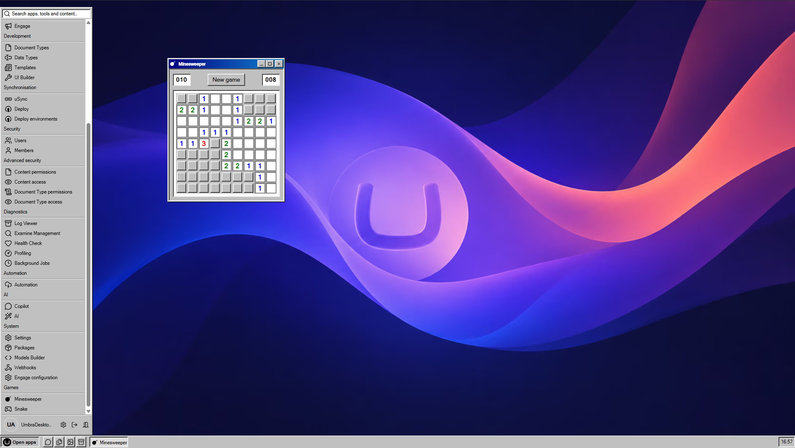
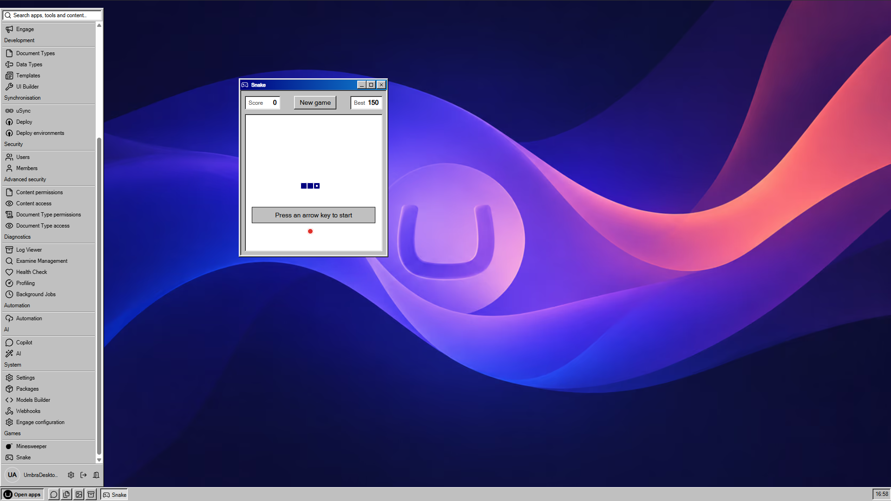
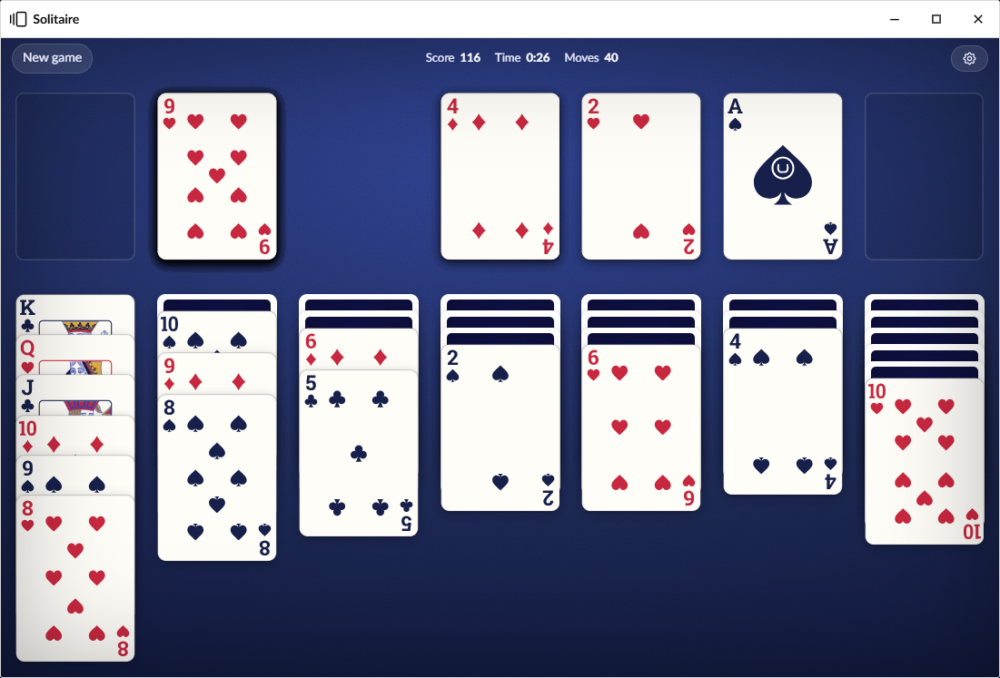

# Games

UmbraDesktop Entertainment puts Minesweeper, Snake and Solitaire on the desktop, each in a window of its own,
under whichever theme is in use. So Minesweeper under the Windows 98 theme looks like Minesweeper, and
under the macOS theme does not.

The games ship in their own package rather than in UmbraDesktop, because a desktop and a minesweeper
are not the same product, and nobody should have to take the second to get the first.

## Install

```bash
dotnet add package Umbraco.Community.UmbraDesktop.Entertainment
```

That is the whole installation. UmbraDesktop comes with it as a dependency, so it is installed too if
it is not there yet. There is no section to grant and no dashboard to enable: the games appear in a
**Games** group in the launcher for anyone who can already reach the desktop. Without the package,
the group is not there at all.

Prerequisites:

- Umbraco 17
- .NET 10
- UmbraDesktop 17.x, installed automatically

## Play

To start a game, open the launcher and select **Minesweeper**, **Snake** or **Solitaire** in the Games group.

Minesweeper and Snake open in a fixed-size window, the way Minesweeper did on Windows: the window can
be moved and minimised, but not resized or maximised. Solitaire can be resized.

### High scores

The Arcade keeps your best score in each game: your fastest win in Minesweeper, your highest score
in Snake, and your highest winning score in Solitaire for each draw mode. Each game shows how you
did in its own window:

- Minesweeper shows your result after every win.
- Snake shows it at game over. Your best score at the top of the window, with its crown and your
  rank, opens the leaderboard and pauses the game.
- Solitaire shows it after a win. To see the leaderboard while you play, select the gear in the top
  right corner, then **Show the leaderboard**.

The first time you finish a game, you are asked whether your scores may appear on the leaderboards.
To see every board, open **Arcade** in the Games group. See [Arcade](https://github.com/Luuk1983/Umbraco.Community.UmbraDesktop/blob/main/src/Umbraco.Community.UmbraDesktop.Services.Arcade/docs/user/arcade.md).

### Minesweeper



The real one, on the beginner board, with a mine counter and a timer. The Arcade calls that board Easy.

- To reveal a square, left-click it. An empty square reveals its neighbours too.
- To flag a square, right-click it.

### Snake



Eat the food to grow longer, and do not hit the walls or your own tail.

- To steer, use the arrow keys or WASD.
- To pause, press Space.
- To start again, select **New game**.

Each piece of food is worth ten points, and the snake speeds up as it grows. The best score is
kept on the Arcade, or in the browser without it, where the top of the window shows it as **Best**.
The game also pauses by itself when its window loses focus, so minimising it does not end the game.

Minesweeper and Snake start fresh when the desktop [reopens its windows](https://github.com/Luuk1983/Umbraco.Community.UmbraDesktop/blob/main/docs/user/settings/reopening-windows.md)
after a reload.

### Solitaire



Klondike: build the four foundations up from ace to king in each suit, using the seven columns to
move cards around.

- To move a card or a run of cards, drag it onto a column or a foundation.
- To draw from the stock, select it. When the stock is empty, select it again to turn the waste
  pile back over.
- To send a card to its foundation, double-click it.
- To start again, select **New game**.

When every card is face up, a **Finish** button appears. Select it to have the game play out the
rest. When the last card reaches its foundation, the cards bounce across the table. To end the
cascade, select anywhere or press a key.

Scoring is the Windows scoring: points for each card that reaches a foundation or is turned face up,
and 2 points off for every 10 seconds you take. Winning adds a time bonus.

To change how the game plays or looks:

1. In the Solitaire window, select the gear in the top right corner. The **Settings** window opens.
2. Under **Game**, select **Draw one** or **Draw three**. A change here starts with your next game.
3. Optional: select a **Card back**: **Match theme**, **Rabbit**, **Codegarden**, **CodeCabin** or
   **Dutch Umbraco Alliance**. **Match theme** follows the desktop's theme.
4. Optional: select **Card faces**. **Classic** is the one set that ships.
5. Select **Done**.

An unfinished game survives a refresh, and signing out and back in, in the same browser tab. It is
forgotten when the window closes, when the game is won and when you select **New game**.

Other packages can add card backs and card face sets. See
[Adding a card back or a card face set to Solitaire](../developer/solitaire-decks.md).

## Versions

This package and UmbraDesktop are released together from the same tag and always share a version
number, so matching versions are the compatibility answer. The dependency on UmbraDesktop is a range
rather than an exact version, so upgrading the desktop on its own is fine.

## Writing your own

Nothing in this package is privileged. It reaches the desktop through the same public manifests any
package can register: a `umbraDesktopApp` for each game, and a catalogue for the Games group. So its
source is the worked example for putting an app of your own on the desktop. See
[Building a desktop app](https://github.com/Luuk1983/Umbraco.Community.UmbraDesktop/blob/main/docs/developer/desktop-apps.md)
in the UmbraDesktop developer guide.
