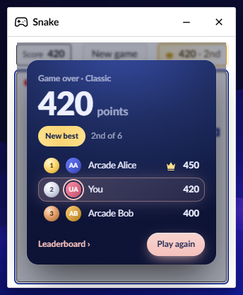
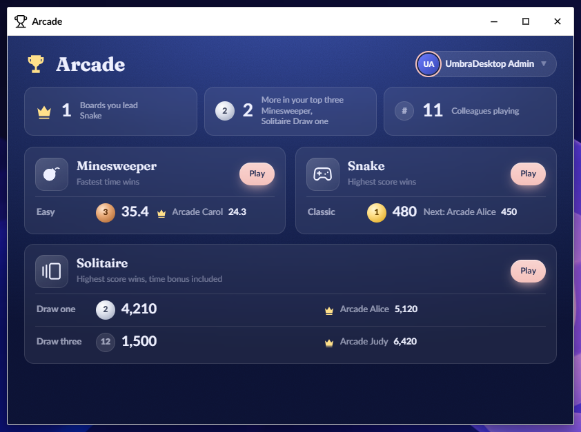

# Arcade

The Arcade keeps your best score on every board of the desktop's games and ranks everyone's. It
arrives with a game that uses it, such as UmbraDesktop Entertainment. You do not install it
yourself.

## After a game

When you finish a game, a card over the game shows how it went: your score, **New best** or
**First place** when it is one, your rank of the number of players, and the top of the board.
Select **Leaderboard ›** to see the whole board, or **Play again** to start a new game.

- Minesweeper shows the card after every win.
- Snake shows it at game over.
- Solitaire shows it after a win, in place of its own win screen, with the time bonus your score
  includes.

In a small window the card is compact: your score, your rank with its medal, and how far you are
behind the player above you.

A game that shows no card still keeps your score, and a notification tells you when it is a new
best.

## The first time

The first time you finish a game, the card asks whether to show your scores on the leaderboard,
with the rank this score would have. Select **Yes, show my scores** or **No, only I see them**.
Until you answer, your scores are hidden. If the answer cannot be saved, the card says "Your
changes could not be saved." and asks again.

While your scores are hidden, each card ends with "Your scores are hidden from the leaderboard."
To show them from there, select **Show them**.

A game that shows no card asks the same question in a dialog.

## See the leaderboard while you play

- On the result card, select **Leaderboard ›**.
- In Snake, select your best score at the top of the window. It shows a crown, your best and your
  rank, such as ♛ 480 · 1st. The game pauses while the leaderboard is open, and carries on when it
  closes. Without the Arcade, the same place shows **Best** and the best score kept in your browser.
- In Solitaire, select the gear in the top right corner, then **Show the leaderboard**. The clock
  stops while the leaderboard is open.

The leaderboard shows how to win, the top three on a podium when there is room, and the rest of the
top ten. When a game has several boards, such as Solitaire's **Draw one** and **Draw three**, the
switch at the top changes between them.

To close the leaderboard, press Esc, select ✕, or select the game around it.

To see the same board in the Arcade, select **Open in the Arcade ›**. The Arcade opens on that
board, and the leaderboard stays open over the game until you close it.

## Open the Arcade

To open the Arcade, open the launcher and select **Arcade** in the Games group. The Arcade is not
there until a game that uses it is installed.

The Arcade opens on where you stand: **Boards you lead**, **More in your top three** and
**Colleagues playing**. Below that is a tile for each game, with a row for each mode: your medal and
best, or **Not played yet**, beside the leader, or who is next when you lead.

- To play a game, select **Play** on its tile. The game opens in its own window.
- To see a game's leaderboard, select its tile. The game's page shows the top three on a podium and
  the rest of the top ten under it. When you are further down, your own row is pinned at the bottom.
- To go back, select **‹ All games**.

While your scores are hidden, your own row still shows where you would stand, marked **Only you see
this**: in its place when you are in the top ten, pinned at the bottom when you are further down.

The Arcade follows your games while it is open, so a score you just set shows without reopening it.

## Show or hide your scores

To show or hide your scores, open the Arcade, select your name, and turn **Show my scores on the
leaderboards** on or off. The change is saved at once. While it is off, colleagues do not see your
scores, and you still see your own rank.

## Change your name on the leaderboards

Your name on the leaderboards starts as your Umbraco name, and can be up to 32 characters.

1. In the Arcade, select your name.
2. In **Your name on the leaderboards**, type the new name.
3. Select **Save**.

## When someone takes first place from you

When a colleague takes first place from you on a board, a notification says so the next time you
open the desktop: the game, both scores and your new rank. Select it to open that leaderboard. This
only happens while your scores are shown.

To stop these notifications, open the Arcade, select your name, and turn off **Tell me when someone
takes first place from me**.

## Delete your scores

To remove everything the Arcade holds about you:

1. In the Arcade, select your name.
2. Select **Delete my scores…**.
3. Select **Delete**. Your scores and Arcade settings are removed from every board. This cannot be
   undone.

Playing again afterwards starts you fresh, with your scores hidden. The Arcade asks the first-time
question again the next time you open the desktop.

## For administrators

A user with the **Users** section can clean up the boards from a game's page in the Arcade. Each
action asks for confirmation first.

- To remove one score, select **⋯** on the player's row, then **Remove score**. The **⋯** menu shows
  when you point at the row or tab to it.
- To give a player their Umbraco name back, select **⋯** on their row, then **Reset name**.
- To remove every score on a board, select **Reset this board** at the bottom of the page.

The Arcade cannot tell a real score from one sent by hand, so this is how junk gets cleaned up.

## When somebody leaves

A colleague whose account is disabled or locked drops off the boards, and returns if the account is
enabled again. A deleted account takes its scores with it.
